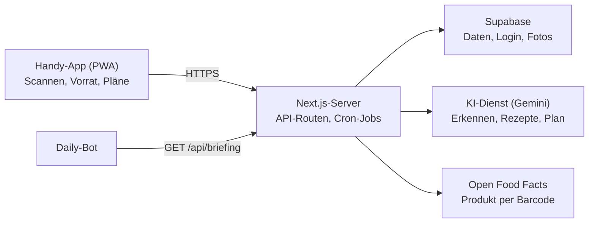

# Küchenbuch – Master-Spezifikation

Stand: 04.10.2026 · Felix

## Ziel & Überblick

Das Küchenbuch ist eine Handy-App (PWA), die weiß, was bei mir zu Hause an Essen da ist, wann es abläuft und was ich daraus kochen kann. Sie soll mir Arbeit abnehmen: Lebensmittel scannen statt tippen, Gerichte vorschlagen lassen statt grübeln, Angebote sehen statt Prospekte wälzen.

**Für wen:** nur für mich (ein Haushalt, eine Person). Frühestens in etwa einem Jahr kommt vielleicht ein Mitbewohner dazu. Das Datenmodell bekommt deshalb schon eine `household_id`, geteilte Nutzung wird aber jetzt nicht gebaut.

**Leitprinzipien**

- **Kostenlos.** Die App verursacht 0 € laufende Kosten: nur kostenlose Stufen von Hosting, Datenbank und KI.
- **Erdnuss-sicher.** Ich habe eine sehr starke Erdnussallergie. Nichts in der App darf mir etwas mit Erdnuss vorschlagen, und Produkte mit Erdnuss oder Spuren davon werden deutlich gewarnt.
- **Schneller als ein Zettel.** Ein Lebensmittel einzutragen dauert höchstens 5 Sekunden (Scan + Bestätigen).
- **Nichts wegwerfen.** Was bald abläuft, steht überall zuerst: im Vorrat, in den Kochvorschlägen, im Morgen-Briefing.
- **Handy zuerst.** Alles ist mit einer Hand am Smartphone bedienbar, funktioniert aber auch am Laptop.
- **KI hilft, entscheidet aber nicht allein.** Jede KI-Erkennung (Produkt, Datum, Prospekt) zeigt mir das Ergebnis zum Bestätigen, bevor es gespeichert wird.
- **Deutsch.** Oberfläche, Kategorien und Rezepte auf Deutsch, Datumsformat TT.MM.JJJJ, Preise in Euro.

**Auftrag an Claude Code:** Baue die App nach dieser Spezifikation, Phase für Phase (siehe Bauphasen). Wenn etwas unklar ist oder eine Entscheidung mehrere sinnvolle Wege hat, frag mich, statt zu raten. Einen Prototyp gibt es noch nicht; Bedienung und Ton entstehen ab Phase 1 auf Grundlage dieser Spezifikation.

## Funktionen im Detail

Die App hat sieben Bereiche: Vorrat, Scannen, Kochen (KI), Essensplan, Einkaufsliste, Prospekte und das Morgen-Briefing. Dazu kommen Einstellungen mit meinen Vorlieben.

### 1. Vorrat (was zu Hause ist)

Jedes Lebensmittel hat: Name, Marke (optional), Menge + Einheit (Stück, g, ml, Packung), **Kategorie**, **Lagerort**, Datum, Datumsart, Geöffnet-am (optional), Foto (optional), Barcode (optional).

- **Thematisch geordnet:** Die Hauptansicht gruppiert nach Kategorie (Tabelle unten). Umschaltbar auf „nach Lagerort“ und „nach Ablaufdatum“.
- **Ablauf-Status:** rot = abgelaufen oder heute, gelb = 1–3 Tage, grün = länger, grau = ohne Datum. Oben eine Leiste: „2 heute fällig, 3 in den nächsten 3 Tagen“.
- **MHD vs. Verbrauchsdatum:** „Mindestens haltbar bis“ (MHD) und „Zu verbrauchen bis“ (Verbrauchsdatum, v. a. Hack, Geflügel, Fisch) werden unterschieden. Beim MHD zeigt die App „abgelaufen, aber meist noch gut – prüfen“, beim Verbrauchsdatum „nicht mehr essen“.
- **Geöffnet:** Ein Tipp auf „Geöffnet“ verkürzt die Haltbarkeit nach Faustregel (z. B. Milch 3 Tage, passierte Tomaten 4 Tage), sofern das früher ist als das aufgedruckte Datum.
- **Teilweise verbraucht:** Menge per Schieberegler reduzieren („halbe Packung übrig“), nicht nur ganz löschen.
- **Aktionen pro Eintrag:** Verbraucht · Weggeworfen (zählt für eine kleine Statistik „Weggeworfen diesen Monat“) · Nachkaufen (auf die Einkaufsliste) · Bearbeiten.
- **Suche** über den ganzen Vorrat.

| Kategorie | Beispiele | Typischer Lagerort |
| --- | --- | --- |
| Obst | Äpfel, Bananen, Beeren | Obstschale / Kühlschrank |
| Gemüse & Salat | Paprika, Zwiebeln, Spinat | Kühlschrank / Vorrat |
| Milchprodukte & Eier | Milch, Joghurt, Käse, Eier | Kühlschrank |
| Fleisch, Fisch & Ersatz | Hack, Hähnchen, Lachs, Tofu | Kühlschrank / Tiefkühler |
| Brot & Backwaren | Toast, Brötchen | Brotkasten |
| Nudeln, Reis & Getreide | Spaghetti, Reis, Haferflocken | Vorrat |
| Konserven & Saucen | Dosentomaten, Kichererbsen, Tomatenmark | Vorrat |
| Backen & Grundzutaten | Mehl, Zucker, Öl | Vorrat |
| Gewürze & Würzmittel | Salz, Paprikapulver, Sojasauce | Vorrat |
| Tiefkühlware | TK-Gemüse, Pizza | Tiefkühler |
| Snacks & Süßes | Chips, Schokolade | Vorrat |
| Getränke | Saft, Wasser | Vorrat / Kühlschrank |

Kategorien und Lagerorte kann ich in den Einstellungen umbenennen, ergänzen und sortieren.

### 2. Scannen (Lebensmittel und Datum erkennen)

Ein großer Scan-Knopf ist von überall erreichbar. Er öffnet die Kamera mit vier Modi:

1. **Barcode:** Kamera liest den EAN-Code. Die App fragt [Open Food Facts](https://openfoodfacts.github.io/openfoodfacts-server/api/) ab und füllt Name, Marke, Menge, Foto und Kategorie vor. Danach direkt weiter zu Schritt 2 (Datum). Unbekannter Barcode → Foto der Packung, die KI erkennt das Produkt; der Barcode wird mit meinem Eintrag lokal gemerkt, damit der nächste Scan sofort klappt.
2. **Ablaufdatum:** Foto vom Datumsaufdruck. Die KI liest das Datum und erkennt, ob MHD oder Verbrauchsdatum. Ergebnis zum Bestätigen, mit Datumsfeld zum Korrigieren. Kein Datum lesbar → Schätzwert nach Kategorie, als „geschätzt“ markiert.
3. **Lose Ware:** Foto von Obst/Gemüse ohne Barcode (auch mehrere Sachen auf einem Bild). Die KI listet, was sie sieht, mit geschätzter Menge und Haltbarkeit.
4. **Kassenbon:** Foto vom Bon. Die KI macht aus den Abkürzungen („H-MILCH 1,5% 1L“) eine Liste mit Kategorien und geschätzten Daten. Ich hake ab, was übernommen wird. Passende Einträge auf der Einkaufsliste werden als gekauft markiert.

Wichtig: Barcode-Erkennung muss auf iPhone (Safari) und Android (Chrome) laufen. Die eingebaute Browser-Funktion dafür ([BarcodeDetector](https://developer.mozilla.org/en-US/docs/Web/API/BarcodeDetector)) ist nicht in allen Browsern verfügbar, also eine Bibliothek als Fallback nutzen.

**Erdnuss-Check beim Scannen:** Open Food Facts liefert Allergene und „kann Spuren enthalten“. Enthält ein Produkt Erdnuss, zeigt die App eine rote Warnung, die ich aktiv wegklicken muss. Bei Spuren gibt es eine gelbe Warnung. Produkte, die nur die KI erkannt hat (ohne Datenbank-Treffer), bekommen den Hinweis „Allergene nicht geprüft – Packung lesen“. Die App ersetzt nie das Lesen der Zutatenliste.

### 3. Vorlieben (Einstellungen)

Alles hier fließt in die KI-Vorschläge und den Essensplan ein:

- **Ernährungsform:** z. B. alles, vegetarisch, vegan, pescetarisch, flexitarisch
- **Allergien & Unverträglichkeiten:** werden IMMER hart ausgeschlossen
- **Mag ich nicht:** Zutaten, die nie vorkommen sollen
- **Lieblingsküchen & -gerichte:** z. B. italienisch, asiatisch, Hausmannskost
- **Ziele:** z. B. proteinreich, günstig, Meal-Prep für mehrere Tage
- **Alltag:** Portionen pro Mahlzeit, maximale Kochzeit unter der Woche / am Wochenende, Budget pro Woche
- **Küchengeräte:** z. B. Herd, Backofen, Airfryer, Mikrowelle, Mixer
- **Grundvorrat:** Zutaten, die immer als vorhanden gelten (Salz, Pfeffer, Öl …), ohne sie einzeln zu pflegen

**Meine Angaben (Startwerte):**

| Einstellung | Wert |
| --- | --- |
| Ernährung | ausgewogen und gesund, möglichst naturbelassen; Bio/naturbelassene Produkte bevorzugen (z. B. Aldi „Nur Nur Natur“) |
| Allergie | **Erdnuss, sehr stark** – harter Ausschluss, auch Erdnussöl, Erdnussbutter, Erdnusssauce, Saté |
| Mag ich nicht | saurer/eingelegter Fisch (z. B. Rollmops, Bismarckhering); Kokos in jeder Form (Kokosmilch, -öl, -raspeln) |
| Budget | ca. 80 € pro Woche als Obergrenze |
| Portionen | flexibel: lieber größer für Meal-Prep, je nachdem wie viel vom Vorrat da ist |
| Geräte | Backofen, Herd, Mikrowelle, Ninja Double Stack Airfryer, Mixer |
| Märkte | Aldi, Lidl, Wasgau |

### 4. Kochen mit KI

- **„Was kann ich heute kochen?“** liefert 3–5 Vorschläge. Reihenfolge: Gerichte, die Bald-Ablaufendes aufbrauchen, zuerst. Jeder Vorschlag zeigt: Name, Zeit, Schwierigkeit, „nutzt aus deinem Vorrat“ (grün), „fehlt“ (gelb, mit Angebot falls vorhanden).
- **Filter vor dem Fragen:** „Nur mit dem, was da ist“ (0 fehlende Zutaten), „schnell (≤ 20 Min.)“, freier Wunsch („was Warmes“, „Pasta“).
- **Rezept-Ansicht:** Zutaten mit Mengen für meine Portionszahl, Schritte nummeriert, Koch-Modus (große Schrift, Bildschirm bleibt an, Timer pro Schritt).
- **„Gekocht“:** zieht die verwendeten Mengen vom Vorrat ab (Vorschau zum Bestätigen).
- **Merken & bewerten:** Daumen hoch/runter; Favoriten bilden ein eigenes Rezeptbuch; die KI berücksichtigt Bewertungen beim nächsten Mal.
- **Resteverwertung:** „Das muss weg“ – ich wähle 1–3 Zutaten, die KI baut darum herum.

**Doppelte Sicherung:** Die KI bekommt die Ausschlüsse im Prompt. Zusätzlich prüft der Server jedes Rezept vor dem Anzeigen gegen eine Sperrliste (Erdnuss und Varianten, Kokos, eingelegter Fisch). Ein Treffer wird verworfen, nicht angezeigt. Dieser Check hat eigene Tests.

**Meal-Prep:** Vorschläge können für 2–4 Tage gedacht sein. Die Portionszahl ergibt sich aus dem, was im Vorrat ist, mit Hinweis wie es sich hält (Kühlschrank / einfrieren) und wie man es aufwärmt (Mikrowelle, Airfryer).

### 5. Essensplan

- Wochenansicht (Mo–So), pro Tag Mittag und Abend (konfigurierbar).
- Gerichte per Tippen eintragen: aus Vorschlägen, Favoriten oder frei.
- **„Woche planen“:** Die KI füllt die Woche passend zu Vorrat, Ablaufdaten, Vorlieben, Budget und aktuellen Angeboten. Ich kann einzelne Tage neu würfeln.
- Aus dem Plan entsteht die Einkaufsliste: benötigte Zutaten minus Vorrat.
- Erinnerung am Vorabend, wenn etwas aus dem Tiefkühler muss („Hähnchen für morgen auftauen“).

### 6. Einkaufsliste

- Sortiert nach Kategorien in der Reihenfolge, wie ich durch den Laden laufe (Reihenfolge einstellbar, z. B. Obst & Gemüse zuerst).
- Einträge kommen von: Hand, „Nachkaufen“, Essensplan, KI-Vorschläge, Angebote.
- Doppelte werden zusammengeführt („Zwiebeln“ aus zwei Rezepten → eine Zeile mit Summe).
- Neben einem Eintrag steht, wenn er gerade im Angebot ist („Aldi: 0,99 € bis Sa“).
- Abhaken im Laden; danach „Einräumen“: abgehakte Sachen wandern in den Vorrat, Datum wird nachgefragt (Scan oder Schätzung).
- Optional später: Liste teilen (z. B. mit Mitbewohnern).

### 7. Prospekte & Angebote

- **Meine Märkte:** Aldi, Lidl und Wasgau, dazu meine PLZ, weil Angebote regional verschieden sind. Weitere Märkte lassen sich in den Einstellungen ergänzen.
- **Prospekt einlesen (Version 1):** Ich lade den Prospekt als PDF hoch oder fotografiere Seiten. Die KI zieht daraus: Produkt, Marke, Preis, Grundpreis, Rabatt, gültig von/bis, Markt. Ich bekomme eine Liste zum Durchsehen.
- **Automatischer Import (später, nur wenn erlaubt):** Supermarktketten bieten keine öffentliche Angebots-Schnittstelle; Prospekt-Apps wie [kaufDA](https://www.kaufda.de/Branchen/Supermarkt) oder [marktguru](https://www.marktguru.de/prospekte) bündeln sie in eigenen Apps. Ein automatischer Abruf kommt nur in Frage, wenn die Nutzungsbedingungen der Quelle das erlauben. Claude Code prüft das und fragt mich, bevor er so etwas baut.
- **Nutzen der Angebote:** Treffer zu meiner Einkaufsliste und meinen Lieblingsprodukten werden hervorgehoben („Deine Haferflocken sind bei Lidl 30 % günstiger“). Die KI berücksichtigt Angebote beim Essensplan.
- Abgelaufene Angebote verschwinden automatisch.

### 8. Morgen-Briefing (für meinen Daily-Bot)

Jeden Morgen um eine einstellbare Uhrzeit (Standard 06:30, Zeitzone Europe/Berlin) erzeugt die App eine kurze Zusammenfassung:

- **Läuft heute/morgen ab:** mit Lagerort, Verbrauchsdatum vor MHD
- **Heute auf dem Plan:** Mittag/Abend, mit Hinweis was fehlt oder aufgetaut werden muss
- **Tipp:** ein Rezept, das das Dringendste aufbraucht
- **Angebote:** höchstens 3 relevante Treffer, die heute enden

Der Daily-Bot holt das Briefing über eine geschützte Schnittstelle ab (Text und JSON, siehe Technik). Ist nichts zu melden, sagt das Briefing das in einem Satz. Beispiel:

```markdown
**Küche heute**
- Heute fällig: Hackfleisch (Kühlschrank, Verbrauchsdatum), Joghurt (MHD)
- Morgen: Spinat
- Plan heute Abend: Chili sin Carne – Kidneybohnen fehlen
- Tipp: Hack heute als Bolognese verbrauchen (25 Min.)
```

## Technik

Empfehlung: eine installierbare Web-App (PWA) mit Next.js und Supabase, komplett in kostenlosen Stufen. Die KI läuft über das kostenlose Kontingent der Gemini API von Google und wird nur vom Server aufgerufen, nie direkt aus dem Browser. Wenn Claude Code einen gleichwertigen, einfacheren Stack begründet vorschlägt, ist das okay – vorher fragen.



Die Handy-App spricht nur mit dem eigenen Server; der Server ruft Supabase, den KI-Dienst und Open Food Facts auf und liefert dem Daily-Bot das Briefing. Der KI-Schlüssel bleibt auf dem Server.

### Stack

| Baustein | Wahl | Warum |
| --- | --- | --- |
| App | Next.js (App Router) + TypeScript, als PWA | Ein Code für Handy und Laptop, aufs Homescreen installierbar, Kamera im Browser nutzbar |
| Oberfläche | Tailwind CSS, Komponenten selbst gebaut oder shadcn/ui | Schnell, konsistent, Dark Mode |
| Daten & Login | Supabase (Postgres, Auth, Storage) | Login, Datenbank mit Zeilenrechten und Fotospeicher in einem |
| Geplante Jobs | Supabase Cron oder Vercel Cron | Morgen-Briefing, Aufräumen abgelaufener Angebote |
| KI | Gemini API (Google), kostenloses Kontingent, mit Bildeingabe; Anbieter austauschbar | Datum lesen, Produkte/Bons/Prospekte erkennen, Rezepte, Wochenplan |
| Produktdaten | Open Food Facts API | Kostenlos, deutsche Produkte gut abgedeckt |
| Barcode | `@zxing/browser` (Fallback), `BarcodeDetector` wo vorhanden | Läuft auch auf iPhone |
| Hosting | Vercel (App) + Supabase (Daten) | Beides kostenlos: Vercel Hobby für private Projekte, Supabase Free (500 MB Datenbank, 1 GB Speicher) |
| Validierung | zod | KI-Antworten werden gegen ein Schema geprüft |

### Datenmodell

Alle Tabellen haben `user_id` (und `household_id` für später) und Row Level Security: jeder sieht nur seine eigenen Daten.

| Tabelle | Wichtige Felder |
| --- | --- |
| `pantry_items` | name, brand, quantity, unit, category_id, location_id, date, date_type (`mhd` / `verbrauch`), date_estimated (ja/nein, entschieden in Phase 1), opened_at, barcode, photo_path, status (`da` / `verbraucht` / `weggeworfen`), status_changed_at, allergen_warning, created_at |
| `products` | barcode, name, brand, default_category_id, image_url, allergens[], traces[], source (`off` / `ki` / `manuell`) – Cache für Barcode-Treffer |
| `categories` / `locations` | name, sort_order, icon; Kategorien zusätzlich default_location_id (typischer Lagerort) und aisle_order (Laden-Reihenfolge) |
| `shelf_life_rules` | category_id, location_id und/oder keyword, days_closed, days_opened – für Schätzungen; die genaueste passende Regel gewinnt |
| `shopping_items` | name, quantity, unit, category_id, checked, source (`hand` / `nachkaufen` / `plan` / `rezept` / `angebot`), offer_id |
| `recipes` | title, servings, minutes, ingredients (JSON), steps (JSON), source (`ki` / `manuell`), rating, favorite |
| `meal_plan` | date, slot (`mittag` / `abend`), recipe_id oder freier Text, cooked |
| `stores` / `offers` | store, product, brand, price, unit_price, discount, valid_from, valid_to, flyer_upload_id |
| `preferences` | diet, allergies[], dislikes[], cuisines[], goals[], servings, max_minutes_weekday, max_minutes_weekend, budget_week, appliances[], staples[], aisle_order[], briefing_time |
| `api_tokens` | token_hash, label, created_at, last_used_at – für den Daily-Bot |

### Server-Schnittstellen

| Route | Zweck |
| --- | --- |
| `GET /api/products/:ean` | Barcode → erst eigener Cache, dann Open Food Facts |
| `POST /api/scan` | Bild + Modus (`datum` / `produkt` / `lose-ware` / `kassenbon`) → erkannte Einträge als JSON zum Bestätigen |
| `POST /api/ai/suggest` | Kochvorschläge aus Vorrat, Vorlieben, Angeboten, Wunsch |
| `POST /api/ai/plan-week` | Wochenplan + daraus resultierende Einkaufsliste |
| `POST /api/offers/import` | Prospekt-PDF oder -Fotos → Angebote zum Durchsehen |
| `GET /api/briefing?format=text\|json` | Morgen-Briefing, Auth per `Authorization: Bearer <token>` |

Optional zusätzlich: Die App schickt das Briefing zur eingestellten Uhrzeit selbst per Webhook an meinen Bot (URL in den Einstellungen).

### KI-Einsatz

- **Strukturierte Antworten:** Jeder KI-Aufruf verlangt JSON nach festem Schema (strukturierte Ausgabe des KI-Dienstes) und wird mit zod geprüft. Bei ungültiger Antwort: einmal neu versuchen, dann freundliche Fehlermeldung.
- **Modellwahl:** Anbieter und Modelle stecken hinter einer eigenen Schnittstelle (`lib/ai`) und stehen in der Konfiguration. So kann ich später ohne Umbau wechseln, z. B. zur Claude API. Für Kleinkram (Kategorie raten, Zutatenliste) das kleinste kostenlose Modell, für Bilder und Wochenplan das stärkste kostenlose.
- **Feste Regeln im Prompt:** Allergien sind Ausschlusskriterium; deutsche Zutatennamen und Einheiten; Portionen laut Einstellung; Grundvorrat gilt als vorhanden; Bald-Ablaufendes zuerst verwenden.
- **Kontext kompakt halten:** Vorrat als kurze Liste (Name, Menge, Tage bis Ablauf) statt ganzer Datensätze.
- **Bilder:** vor dem Hochladen im Browser verkleinern; nach erfolgreicher Erkennung löschen, außer ich will das Foto behalten.

### Sicherheit & Kosten

- **0 € laufende Kosten:** Claude Code fügt keinen kostenpflichtigen Dienst hinzu und aktiviert keine Abrechnung ohne meine ausdrückliche Zustimmung.
- Der KI-Schlüssel (aus Google AI Studio) liegt nur als Umgebungsvariable auf dem Server, nie im Browser oder im Git-Repo.
- Das Gratis-Kontingent der Gemini API ist begrenzt (Anfragen pro Minute und Tag). Die App hat ein eigenes Tageslimit, puffert Ergebnisse und zeigt beim Erreichen „KI-Kontingent für heute aufgebraucht, morgen wieder“, statt Fehler zu werfen. Laut [Googles Bedingungen](https://ai.google.dev/gemini-api/terms) gelten für Nutzer in der EU auch beim Gratis-Kontingent die Datenregeln der bezahlten Dienste.
- Open Food Facts verlangt einen eigenen User-Agent im Format `AppName/Version (Kontakt)` und begrenzt Produktabfragen auf 15 pro Minute je IP ([Doku](https://openfoodfacts.github.io/openfoodfacts-server/api/)). Deshalb jedes Ergebnis in `products` cachen.
- Supabase Free pausiert ein Projekt nach einer Woche ohne Aktivität ([Preise](https://supabase.com/pricing)). Der tägliche Briefing-Job hält es aktiv. Wegen 1 GB Speicher: Fotos im Browser verkleinern und nach der Erkennung löschen.
- Briefing-Tokens sind widerrufbar und werden nur gehasht gespeichert.

## Bauphasen

Acht Phasen (0–7), jede endet mit einer App, die ich wirklich benutzen kann. Eine Phase gilt erst als fertig, wenn alle Haken gesetzt sind und ich sie am Handy ausprobiert habe.

### Phase 0 – Fundament

- [x] Projekt aufgesetzt (Next.js, TypeScript, Tailwind, Supabase), Git-Repo, `CLAUDE.md` mit Projektregeln
- [x] Login per E-Mail-Link funktioniert (nur Link, kein Code: Mail-Vorlagen lassen sich ohne eigenes SMTP nicht ändern; der Link klappt nur im selben Browser, in dem er angefordert wurde)
- [x] App lässt sich am Handy aufs Homescreen installieren (PWA-Manifest, Icon) – technisch erfüllt, Knopf „App installieren“ eingebaut; auf dem Samsung S25 bieten Chrome und Samsung Internet das Ablegen auf dem Startbildschirm nicht an (auch bei anderen Web-Apps), daher vorerst über „Quick access“ in Samsung Internet
- [x] Online erreichbar (Vercel), Umgebungsvariablen dokumentiert in `.env.example`
- [x] Alle Dienste laufen in kostenlosen Stufen, keine Zahlungsdaten hinterlegt (Vercel Hobby, Supabase Free, geprüft am 05.10.2026)

### Phase 1 – Vorrat & Einkaufsliste (ohne KI)

- [x] Vorrat anlegen, bearbeiten, verbrauchen, wegwerfen; gruppiert nach Kategorie, umschaltbar auf Lagerort und Ablaufdatum
- [x] Ablauf-Status in Farben + Leiste „heute fällig / bald fällig“
- [x] MHD vs. Verbrauchsdatum, „Geöffnet“ verkürzt die Haltbarkeit
- [x] Haltbarkeits-Schätzung nach Kategorie/Schlagwort, wenn kein Datum eingegeben wird
- [x] Einkaufsliste nach Laden-Reihenfolge sortiert, abhaken, „Einräumen“ in den Vorrat
- [x] Kategorien und Lagerorte in den Einstellungen bearbeitbar

### Phase 2 – Scannen

- [ ] Barcode-Scan auf iPhone und Android, Treffer über Open Food Facts mit Cache
- [ ] Erdnuss-Check mit roter/gelber Warnung beim Scan
- [ ] Datum per Foto erkennen, inkl. MHD/Verbrauchsdatum, mit Korrekturfeld
- [ ] Lose Ware per Foto (mehrere Sachen auf einem Bild)
- [ ] Kassenbon per Foto → Liste zum Abhaken, gleicht Einkaufsliste ab
- [ ] Vom Öffnen des Scanners bis zum gespeicherten Eintrag ≤ 5 Sekunden bei bekanntem Barcode

### Phase 3 – Vorlieben & Kochen mit KI

- [ ] Einstellungsseite für alle Vorlieben aus Abschnitt 3, vorbelegt mit „Meine Angaben“
- [ ] „Was kann ich heute kochen?“ mit Filtern, Bald-Ablaufendes zuerst
- [ ] Rezept-Ansicht mit Koch-Modus (Bildschirm bleibt an, Timer)
- [ ] „Gekocht“ zieht Zutaten vom Vorrat ab
- [ ] Sperrlisten-Check auf dem Server: kein Vorschlag mit Erdnuss, Kokos oder eingelegtem Fisch (mit Tests)
- [ ] Favoriten und Bewertungen

### Phase 4 – Essensplan

- [ ] Wochenansicht, Gerichte eintragen und verschieben
- [ ] „Woche planen“ per KI, einzelne Tage neu würfeln
- [ ] Einkaufsliste aus dem Plan (Bedarf minus Vorrat, Doppelte zusammengeführt)
- [ ] Auftau-Erinnerung am Vorabend

### Phase 5 – Prospekte

- [ ] Märkte und PLZ einstellbar
- [ ] Prospekt-PDF oder Fotos hochladen → Angebote zum Durchsehen → speichern
- [ ] Angebote erscheinen auf der Einkaufsliste und fließen in Vorschläge und Wochenplan ein
- [ ] Abgelaufene Angebote verschwinden automatisch

### Phase 6 – Morgen-Briefing

- [ ] `GET /api/briefing` liefert Text und JSON, geschützt per Token
- [ ] Token in den Einstellungen erzeugen und widerrufen
- [ ] Briefing-Uhrzeit einstellbar; optionaler Webhook-Versand
- [ ] Briefing ist so gebaut, dass jeder Bot es nutzen kann (Abholen per Schnittstelle oder Empfangen per Webhook); die konkrete Anbindung folgt, sobald mein Daily-Bot feststeht

### Phase 7 – Feinschliff (optional)

- [ ] Vorrat und Einkaufsliste auch offline lesbar, Änderungen werden nachsynchronisiert
- [ ] Statistik: weggeworfen pro Monat, meistgekochte Gerichte
- [ ] Einkaufsliste mit anderen teilen

## Arbeitsanweisung für Claude Code

So soll Claude Code mit diesem Dokument arbeiten:

1. Dieses Dokument als `docs/SPEC.md` ins Repo legen und in `CLAUDE.md` darauf verweisen.
2. Vor jeder Phase einen kurzen Plan zeigen (Plan-Modus) und auf mein Okay warten.
3. Nur die aktuelle Phase bauen. Ideen für später in `docs/IDEEN.md` sammeln, nicht nebenbei einbauen.
4. Nach jeder Phase: Tests für die Logik (Ablauf-Status, Haltbarkeits-Schätzung, Mengen abziehen, Einkaufsliste aus Plan, Sperrliste), App starten, Haken in `docs/SPEC.md` setzen, Commit.
5. Bei Entscheidungen mit mehreren sinnvollen Wegen, bei Kosten (neue kostenpflichtige Dienste) und bei rechtlich unklaren Datenquellen: erst fragen.
6. Erklär mir nach jeder Phase in 3–5 Sätzen, was neu ist und wie ich es teste. Ich will den Code auch verstehen und dabei lernen.

### Offene Fragen an mich

- [ ] Welcher Daily-Bot? Noch offen. Bis dahin: Schnittstelle + Webhook bauen, Anbindung später.
- [ ] Budget: Sind die 80 € pro Woche gemeint (Annahme) oder pro Monat?
- [ ] KI-Schlüssel: Ich lege ihn in Google AI Studio an; Claude Code erklärt mir die Schritte, wenn Phase 2 beginnt.
- [x] Märkte: Aldi, Lidl, Wasgau
- [x] Ernährung, Allergie, No-Gos, Portionen, Geräte: siehe „Meine Angaben“
- [x] Kosten: 0 €, nur kostenlose Stufen
- [x] Nutzer: nur ich, frühestens in einem Jahr evtl. ein Mitbewohner

### Quellen

- [Open Food Facts API – Einführung, Limits, User-Agent](https://openfoodfacts.github.io/openfoodfacts-server/api/)
- [Open Food Facts API – Tutorial (Produkt per Barcode)](https://openfoodfacts.github.io/openfoodfacts-server/api/tutorial-off-api/)
- [Gemini API – Preise und kostenloses Kontingent](https://ai.google.dev/gemini-api/docs/pricing)
- [Gemini API – Zusätzliche Nutzungsbedingungen (EU-Regel)](https://ai.google.dev/gemini-api/terms)
- [Supabase – Preise (Free-Plan, Pausieren)](https://supabase.com/pricing)
- [MDN – BarcodeDetector](https://developer.mozilla.org/en-US/docs/Web/API/BarcodeDetector)
- [kaufDA – Supermarkt-Prospekte](https://www.kaufda.de/Branchen/Supermarkt), [marktguru – Prospekte](https://www.marktguru.de/prospekte)
